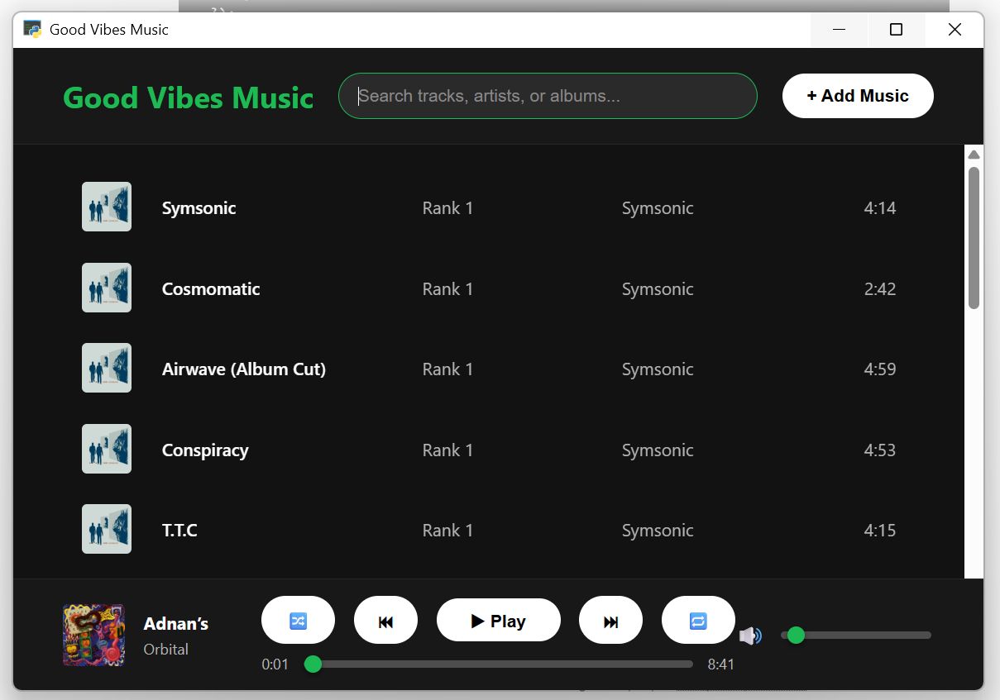
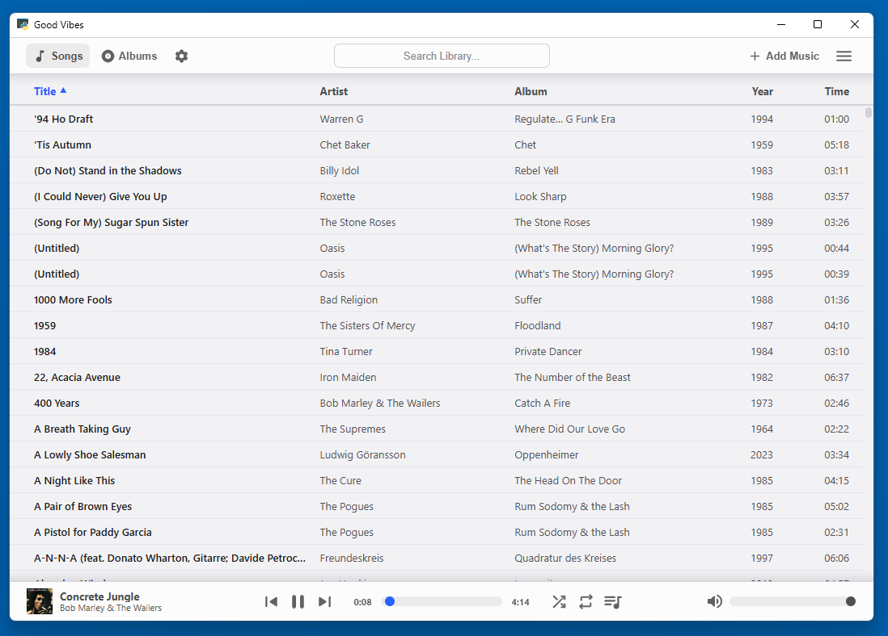
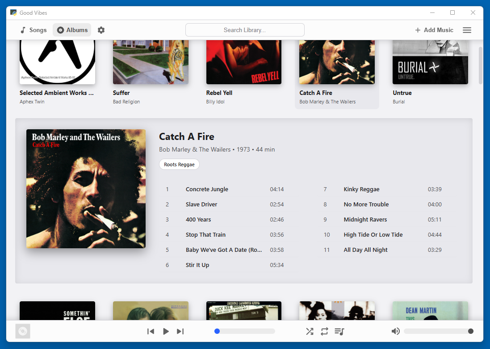

# Good Vibes Music Library

## Einleitung

Der Konsum digitaler Musik hat sich in den letzten 15 Jahren immer mehr in Richtung Streaming entwickelt. Verbreitete Anwendungen wie  Spotify oder Apple Music zielen primär darauf ab, Musik als Dienstleistung im Abo zu verkaufen.

Zwar können diese Produkte durchaus dazu genutzt werden, um auch lokale Musikdateien abzuspielen, doch sind sie für diesen use case nicht optimiert: Der Streaming-Service – das eigentliche Kernprodukt – ist omnipräsent, auch wenn der User ihn nicht nutzt. Er drängt sich stets als Bloatware auf und schmälert die Usability.

Die Suche nach geeigneten Alternativen zum Abspielen einer lokalen Musiksammlung ist nicht einfach, denn der Fokus auf Streaming hat den lokalen Desktop-Audioplayer zu einer Nischen-Anwendung werden lassen.

## Projektplanung

#### Zielsetzung

Basierend auf dem beschriebenen Ist-Zustand hat dieses Projekt die Entwicklung einer Musik-Library für lokale Dateien zum Ziel. Grob orientiert an iTunes 12 (erschienen 2014) liegt der Fokus auf einer visuell ansprechenden   Darstellung einer großen Anzahl lokaler Musikdateien. Auf diese Weise sollen auch umfangreiche Sammlungen dem User strukturiert präsentiert werden können, ohne dabei jedoch durch ein Übermaß an Verwaltungsfunktionen und Einstellungsmöglichkeiten vom eigentlichen Musikgenuss abzulenken. Ziel ist die Entwicklung einer schnörkellosen, plattformunabhängigen Anwendung.

#### Anforderungen

Die funktionalen Anforderungen, die vom Programm unbedingt erfüllt werden müssen, lauten wie folgt:

- Lokale Musikdateien der Formate mp3 und ma4 müssen einer **Datenbank** hinzugefügt werden können. Diese Datenbank mus bei jedem Programmstart automatisch aufgerufen und der Inhalt in einer grafischen Oberfläche dargestellt werden. Zum Inhalt der Datenbank sollen neben den Pfaden der Musikdateien auch deren zentrale Metadaten zählen.

- Die grafische Oberfläche Programms muss zwei Arten der **Darstellung** ermöglichen, die an das Vorbild iTunes 12 angelehnt sind: (a) eine Darstellung aller Songs der Datenbank als Liste und (b) eine Darstellung, in der die einzelnen Songs zu Alben aggregiert sind und visuell durch die Cover Art der Alben repräsentiert werden.

- Um das Auffinden von Songs auch in großen Sammlungen zu ermöglichen, muss die Anwendung über eine **Filterfunktion** verfügen, mit der nach wichtigen Merkmalen wie Titel, Interpret oder Album gesucht werden kann.

- Bei der **Wiedergabe** der Musikdateien müssen die klassichen Funktionen eines Audio-Players geährleistet sein, d.h. Play/Pause, Skipping, Shuffle Mode, Single Repeat und Repeat All.

- Die grafische Oberfläche muss es nicht nur ermgölichen, Songs wieder aus der Datenbank zu entfernen, sondern sie muss auch das **Editieren von Metadaten** ermgöglichen, um Unstimmigkeiten direkt ohne den Einsatz externer Programme korrigieren zu können.

- Weil die Anwendung selbst nicht für die Verwaltung der Dateien zuständig sein soll, muss sie regelmäßig prüfen, ob die in der Datenbank hinterlegten Dateipfade noch Gültigkeit besitzen. Sollten Dateien modifiziert oder entfernt worden sein, muss eine angemessene **Ausnahmebehandlung** erfolgen, d.h. mindestens eine Fehlermeldung angezeigt werden, besser noch die Möglichkeit zur Korrktur der fehlerhaften Verknüpfung angeboten werden.

Weiterhin sollte das Programm die folgenden Anforderungen erfüllen:

- Die Oberfläche sollte schlicht und zweckmäßig sein. Eine Akzent-Farbe, mit der ausgewählte Teile der UI hervorgehoben werden können, soll vom User frei gewählt werden können.

- Mit einer Normaliisierung der Lautstärken verschiedener Songs soll gewährleistet werden, dass auch der Shuffle-Modus zu einem ungetrübten Hörerlebnis wird.

- Um die Skalierbarkeit der Datenbank zu sichern, sollen die in den Metadaten der Musikdateien eingebetteten Cover-Artworks beim Importieren der Musikdateien separat als Bilddateien auf dem lokalen Datenträger gespeichert werden, statt in der Datenbank hinterlegt zu werden.

- Der Quelltext der Anwendung soll strukturiert und – sofern möglich – objektorientiert sein, um spätere Änderungen und Wartungen reibnugslos zu ermgölichen.

#### Abgrenzung

Nicht realisiert werden sollen folgende, bei vergleichbaren Progammen häufig vorzufindende, Funktionalitäten:

- Möglichkeit zur Erstellung eigener **Playlisten**: Damit NutzerInnen nicht in einen Verwaltungsmodus verfallen und mehr Zeit mit dem Anlegen der perfekten Playlist als mit dem bewussten Hören von Musik verbringen, wird auf dieses Feature gezielt verzichtet.

- Klassisches Rating-System: Auch auf die Implementierung eines **Rating-Systems** wird von vornherein verzichtet, um NutzerInnen gar nicht erst in Versuchung zu führen, ihre 50.000 Songs alle zeitaufwendig zu bewerten.

- **Verwaltung der Dateien** durch die Anwendung selbst: NutzerInnen bleiben für die Ordnerstruktur ihrer Musiksammlung selbst verantwortlich. Neue Dateien müssen händisch importiert werden. Um eine bewusste Designentscheidung handelt es sich herbei jeodhc nicht; daher ist nicht auszuschließen, dass eine solche Funktionalität (wie sie auch iTunes stets bereithielt) zu einem späteren Zeitpunkt implementiert wird.

## Umsetzung

#### Verwendte Technologien

Die Umsetzung der Anwendung erfolgte mit einer Kombination aus Python, SQLite und Standard-Webtechnologien.

- **Python**: Im Kern wird die Anwendung von Python gesteuert. Python greift auf die lokal gespeicherten Musikdateien zu, liest deren Metadaten aus und hält den Kontakt zur SQLite-Datenbank, in der die Pfade der Dateien zusammnen mit den Metadaten gespeichert werden. Zugleich ermöglicht Python über das externe Package `pywebview` die Umsetzung einer modernen Oberfläche, die mit Webtechnologien realisiert wird.

- **SQLite**: Als schlanke und lokale Datenbank-Lösung mit perfekter Anbindung an Python ist SQLite für diese rein lokal betriebene Andwendung ideal geeignet.

- **HTML, CSS, JavaScript**: Um eine moderne, plattformunabhängige Oberfläche zu realisieren, eigent sich ein auf Webtechnologien basiertes Frontend hervorragend. HTML und CSS werden nicht nur den gehobenen visuellen Ansprüche einer Music-Library gerecht, auch kann die Audiowiederhabe vollständig mit HTML5 umgesetzt werden. Die Nutzerinteraktion und die Kommunikation mit dem Backend hingegen werden mit JavaScirpt realisiert.

Ganz bewusst wurden die ersten Schritte dieses Projektes im Pair Programming zusammen mit Google Gemini umgesetzt, um auch diese Spielart der Softwareentwicklung einmal zu erproben und sich damit vertraut zu machen. Als der Quelltext eine Größe erreichte, die vom LLM selbst als „too large for the best results“ bezeichnet wurde, erfolgte weitestgehend der Umstieg auf manuelles Coding.

#### Entwicklungsprozess

Weil der Beginn des Projekts bewusst ein Versuch im *Vibe Coding* mit Hilfe von Google Gemini (Pro, Extended Thinkin) war, soll der Hergang dieser ersten Schritte kurz erläutert werden. Den Ausgangspunkt markierte ein umfaassender Prompt, der selbst bereits von Gemini überarbeitet worden war:

```
# Role & Persona
You are an Expert Senior Software Engineer specializing in cross-platform desktop application development (Windows, macOS, Linux). I am a junior developer with a strong desire to build my own desktop music player application called "Good Vibes Music". 

# My Skill Set
- **Advanced:** Python
- **Very Good:** HTML, CSS, Vanilla JavaScript
- **Foundational/Intermediate:** Java

# Our Working Style: "Vibe Coding"
We will be building this using a "vibe coding" approach. This means we will work iteratively, step-by-step, prioritizing rapid feedback loops, momentum, and a great developer experience. You will act as my mentor, architect, and pair programmer.

To ensure this project is successful and educational for me, you must strictly follow these rules:
1. **Pace Yourself:** Do NOT write the entire application at once. Break the project down into small, digestible, and independently testable phases.
2. **Actionable Steps:** For each step, provide clear instructions on what tools to install, folder structures to create, and terminal commands to run.
3. **The "Why":** Explain the reasoning behind your architectural decisions in simple, easy-to-understand terms. 
4. **Leverage My Skills:** Prioritize technologies that utilize my existing strengths (Python, HTML/CSS/JS) to maintain a gentle learning curve, while still delivering a highly polished, modern UI.

# The Project: "Good Vibes Music"
Here are the core functional requirements for our MVP:
1. **Target Platforms:** Windows, macOS, and Linux (A single codebase is a strict requirement).
2. **Audio Support:** Local `.mp3` and `.m4a` playback.
3. **Metadata Extraction:** Read and display Track Title, Artist, Album, Year, Duration, and embedded Cover Art.
4. **Persistence:** Remember user-added music paths and library states across application restarts.
5. **Library Management:** Add or remove single/multiple files from an existing database.
6. **UI/UX:** A sleek, modern, minimal, and dark-mode-friendly Graphical User Interface. 

# Your First Task
Please acknowledge these instructions and provide the following:
1. **Tech Stack Proposal:** Propose the absolute best tech stack (language, backend, frontend framework, and UI library) for this project. Explain *exactly* why it fits my specific skill set and meets the "modern UI" requirement. Be sure to address how this stack will safely handle local file system access and audio metadata extraction.
2. **Phase 1 Roadmap:** Outline a high-level, multi-phase roadmap for building "Good Vibes Music". Ensure each phase ends with a testable milestone so I can see the progress on my screen.

**CRITICAL:** Do not write any application code yet. Wait for my approval on the tech stack and roadmap before we proceed to Phase 1.
```

Daraufhin gab das LLM sechs Entwicklungsschritte vor, mit denen die genannten Kernfunktionen umgesetzt werden sollten. Aus Neugier befolgte ich die Anweisungen, ohne weitere Inputs zu geben. Das Ergebnis nach Abschluss dieser sechs Entwicklungszyklen erinnerte in Grundzügen an Spotify:



Während die Implementierung der funktionalen Anforderungen zwar geglückt – aber unvollständig – ist, weist die Gestaltung der Oberfläche erhebliche Defizite auf. Die Bedienelemente sind wenig harmonisch zueinander platziert, der Einsatz von Emojis zur Kennzeichnung von Schaltflächen ist bestenfalls eine Notlösung und der riesige Name der Anwendung im Kopfbereich erinnert mehr an eine Website als an eine Desktop-Anwendung.

Anders als zu Beginn vom LLM angekündigt, folgte auf die ersten 6 Entwicklungsschritte überraschend ein siebter Schritt, in dem die Anwendung zu einer auführbaren Binary-Datei kompiliert werden und auf diese Weise das Projekt abgeschlossen werden soll. Gemini verkündet zum Abschluss zufrieden:

>  You have successfully built and shipped a modern desktop application.

Ich weise das LLM darauf hin, das es sich hierbei keinesfalls um eine moderne Desktop-Anwendung handelt, zwei anfangs von mir definierte Funktionalitäten (Entfernen von Songs und Anzeige des Jahres) nicht realisiert worden sind und das Projekt an dieser Stelle nicht für erfolgreich beendet erklärt werden kann.

Gleichzeitig beeindruckt und skeptisch setze ich das Pair Programming mit dem LLM zunächst fort, indem ich gezielt weitere Anforderungen beschreibe, die meine Anwendung ebenfalls erfüllen soll, darunter:

- Light Mode als Ergänzung zur dunklen Oberfläche
- Sortierung der tabellarischen Ansicht
- Editieren und Speichern von Metadaten
- Normalisierung der Lautstärke
- Datei-Import in eigenem Thread
- Umgang mit fehlerhaft verknüpften Dateipfaden
- Auswahl mehrerer Songs mit SHIFT und CTRL
- Cover-Ansicht als zusätzliche Form der Darstellung

Die Implementierung dieser Anforderungen verläuft weitgehend erfolgreich. Fehler werden, wenn man sie dem LLM beschreibt, meist sofort korrigiert. Erst als ich versuche, mit Hilfe eines Prompts die Oberfläche aufzuräumen und nach meinen Vorstellungen zu gestalten, scheitert das LLM zunächst, indem es unvermittelt die IDs der HTML-Elemente ändert und damit die Funktionalität der EventListeners zerstört.

Gänzlich zum Erliegen kommt die Zusammenarbeit zwischen mit und Gemini, als ich mit großem Auswand beschreibe, wie genau die Abspielreihenfolge zustandekommen soll, wenn sich die Sortierreihenfolge ändert oder Filter gesetzt werden. Die anschließende Implementierung ist fehlerhaft und allein Beschreibung des Fehlverhaltens ermöglicht es Gemini nicht, die Bugs eigenständig zu korrigieren. Ich lade also den aktuellen Code (rund 1700 Zeilen inklusive großzügiger Kommentare des LLMs) hoch, erhalte daraufhin aber nur noch vage Hinweise statt konkreter Quelltextänderungen. Außerdem lässt mich Gemini wissen:

> Your uploads may be too large for the best results.

An dieser Stelle überweigt meine Skepsis gegenüber dem reinen Vibe-Coding-Ansatz – auch, weil der beträchtlich angewachsene Code ein nur schwer zu durchschauender Flickenteppich aus einer langen Liste von Funktionen geworden ist. Also bringe ich mühsam Ordnung und Struktur in den Quelltext und setze die Entwicklichung anschließend wieder händisch und mit deutlich weniger Input des Kollegen Gemini fort. 


#### Aufbau der Lösung

Die entwickelte Anwendung ist im Kern ein Python-Programm, das über die Datei `app.py` gestartet wird.

In dieser Datei enthalten ist eine Funktion `init_db()`, die zuvorderst eine neue SQLite-Datenkbank erzeugt, falls bei vorherigen Programmstarts noch keine solche angelegt worden ist. Daneben besteht der größte Teil dieser Datei aus zwei Klassen, die zentral für die Funktion der Anwendung sind:

- `Api()`: Diese Klasse fungiert als Schnittstelle zum Frontend und hält Methoden für den Umgang mit Dateien bereit, die aus der grafischen Oberfläche per JavaScript angesprochen werden können. Zu diesen Methoden zählen vor allem das Hinzufügen und Entfernen von Dateien zur Datenbank, das Editieren von Metadaten sowie das Auslesen und Speichern von Cover-Bildern in einem separaten Cache-Verzeichnis.

- `HttpRequestHandler()`: Diese Klasse nimmt Anfragen an einen mit Hilfe des Moduls `http.server` angelegten lokalen Server entgegen und gibt entweder Audio-Dateien (die importierten Songs) oder Bild-Dateien (die im Cache-Ordner abgelegten Platten-Cover) zurück. Auf diese Weise wird das HTML-Audio-Element, über das im Frontend die Wiedergabe gesteuert wird, mit Quelldateien versorgt.

Der lokale HTTP-Server wird beim Programmstart in einem separaten Thread gestartet und läuft anschließend permanent im Hinergrund.

---

Eine grafische Oberfläche erhält die Anwendung über das externe Python-Package `pywebview`, das beim Programmstart ein natives Fenster des Betriebssystems öffnet und darin die Anzeige einer beliebigen (lokale) URL ermöglicht. Im vorliegenden Fall ist dies schlicht `./gui/index.html`, ergänzt um `style.css` und `main.js`. Da die Oberfläche nicht auf eine bestehende Libary zurückgreift, sondern für dieses Projekt eine ganz individuelle GUI von Grund auf entwickelt worden isd, sind in der JavaScript-Datei rund 55 Prozent der gesamten Code-Basis enthalten. Wesentliche Bestandteile der `main.js` sind die folgenden Klassen:

- `GuiController()`: Diese Klasse „verdrahtet“ die größtenteils in der `index.html` statisch vorgegebene HTML-Struktur mit EventListeners und blidet den Rahmen für sämtliche Interaktivität innerhalb der GUI.

- `MusicLibrary()`: Diese Klasse nimmt zum Programmstart den Inhalt der Datenbank auf und unterscheidet während der Laufzeit des Programms zwischen einer *Master Library* (alle verfügbaren Songs) und einer *Visible Library* (Songs, die aufgrund aktiver Filter tatsächlich angezeigt und abspielbar sind). Auch der Import neuer Dateien in die Datenbank geschieht über eine Methode in dieser Klasse.

- `AudioPlayer()`: Nicht nur das reine Abspielen und die verschiedenen Abspielmodi (Shuffle, Repeat) werden von dieser Klasse übernommen. Auch die vorhergehende Prüfung, ob eine hinterlegte Datei tatsächlich vorhanden ist, ist Aufgabe des Audio-Players. Er verwaltet zudem die Warteschleife der wiederzugebenden Songs und stellt im letzten Schritt den GET-Request an den lokalen HTTP-Server des Python-Backends.

- `SearchEngine()`: Die gesamte Logik der Such- bzw. Filterfunktion, die losgelöst von der Datenbank ausschließlich in der GUI stattfindet, ist in dieser Klasse definiert.

Auch Oberflächen-Komponenten wie Modal-Dialoge oder die beiden Hauptansichten (Songs und Alben) sind mit ihrer internen Logik in der `main.js` als einzelne Klassen angelegt.

Das Ergebnis ist eine Music Library, die – genau wie ihr Vorbild iTunes – die Darstellung der importierten Songs in einer platzsparenden Liste und einer visuell ansprechenden Cover-Ansicht ermöglicht:





## Fazit und Ausblick

Die zu Beginn des Projekts formulierten Anforderungen der höchsten Priorität konnten erfolgreich umgesetzt werden. Auch die als „Should Have“ formulierten Ziele sind im Rahmen der Projektzeit implementiert worden. Die im Projektantrag als „Could Have“ genannten Ziele wurden hingegen nicht umgesetzt.

Der zu Beginn intensiv verfolgte Vibe-Coding-Ansatz ging zunächst mit einem erheblichen Produktivitätsanstieg einher. Im weiteren Projektverlauf erwies sich die so entstandene Code-Basis jedoch als zunehmend undurchsichtiger Flickenteppich, der langfristig weder Wartbarkeit noch Erweiterbarkeit gewährleistest hätte. Weil die notwenidge manuelle Strukturierung mehrere Tage beanspruchte, wurde der anfängliche Zeitgewinn in dieser Phase des Projekts mindestens kompensiert.

Das Testing der Anwendung erfolgte stetig parallel zur  Entwicklung auf manuelle Art. Bis auf geringfügige Bugs, die in Edge Cases der GUI auftreten, ist die korrekte Funktion der Anwendung auf diese Weise gesichert.Systematische Unit Tests, mit denen die erwartbare Funktionsweise des Codes zu einem bestimmten Anteil nachgewiesen werden soll, waren nicht Teil des Anforderungskatalogs und wurden daher auch nicht innerhalb der Projektzeit umgesetzt.

Als kommende Entwicklungsschritte, mit denen die Anwendung unmittelbar erweitert und verbessert werden kann, können insbesondere ins Auge gefasst:

- Das Speichern der User-Einstellungen in einer externen Datei.
- Das Hinzufügen einer Sortiervariablen, damit *The Beatles* unter *B* statt unter *T* gelistet werden.
- Die Gesonderte Berücksichtigung und Darstellung von (1.) Compilations und (2.) jenen Songs, die keinem Album zugeordnet sind.

Weitere, mittelfristig wünschenswerte Verbesserungen sind die Sicherstellung der Kompatibilität der Anwendung mit den Medien-Tasten der Tastatur. Ob hierfür die verwendeten Technologien ausreichen, oder ob ein mächtigeres Framework wie z.B. Electron zum Einsatz kommen muss, bleibt in Folgeprojekten zu eruieren.
